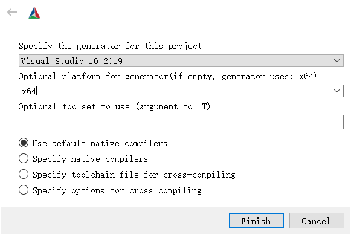
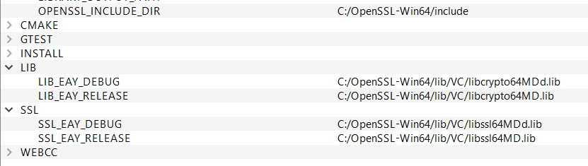

# Build Instructions

* [Overview](#overview)
* [Ubuntu](#ubuntu)
* [Windows](#windows)

## Overview

### Build Dependencies

* [Boost 1.66+](https://www.boost.org/) (asio, system, date_time, filesystem)
* [OpenSSL](https://www.openssl.org/) (for HTTPS, optional)
* [Zlib](https://www.zlib.net/) (for GZIP compression, optional)
* [Googletest](https://github.com/google/googletest) (for automation and unit tests, optional)
* [CMake](https://cmake.org/)

OpenSSL and Zlib are **optional** since they could be disabled. See the build options below.

Googletest is also **optional** unless you want to build the automation and unit tests.

## Build Options

The following CMake options determine how you build the projects. They are quite self-explanatory.

```cmake
option(BUILD_AUTOTEST "Build automation test?" OFF)
option(BUILD_UNITTEST "Build unit test?" OFF)
option(BUILD_EXAMPLES "Build examples?" OFF)
option(BUILD_QT_EXAMPLES "Build Qt application examples?" OFF)

set(WEBCC_ENABLE_LOG   1 CACHE STRING "Enable logging? (1:Yes, 0:No)")
set(WEBCC_ENABLE_SSL   0 CACHE STRING "Enable SSL/HTTPS (need OpenSSL)? (1:Yes, 0:No)")
set(WEBCC_ENABLE_GZIP  0 CACHE STRING "Enable gzip compression (need Zlib)? (1:Yes, 0:No)")

set(WEBCC_LOG_LEVEL    2 CACHE STRING "Log level (0:VERB, 1:INFO, 2:USER, 3:WARN or 4:ERRO)")
```

Automation test is based on a real server: [httpbin.org](http://httpbin.org/).

### Integration

Webcc doesn't support CMake Install right now.

I suggest to integrate it to your project simply by source code. Just copy the webcc sub-folder into your project and add the related CMake options.

Please take a look at this example: [https://github.com/sprinfall/webcc-integration](https://github.com/sprinfall/webcc-integration).

## Ubuntu

*NOTE: Based on Ubuntu 18.04 LTS*

Please install `build-essential` which includes the C++ compiler and more:

```
$ sudo apt install build-essential
```
### CMake

Please refer to [https://apt.kitware.com/](https://apt.kitware.com/).

### OpenSSL

```
$ sudo apt install libssl-dev
```

### Zlib

```
$ sudo apt install zlib1g-dev
```

### Boost

Download the `.tar.bz2` or `.tar.gz` from [here](https://www.boost.org/users/download/#live).

Unpack and go into the directory (suppose Boost version is 1.74):

```
$ tar xzf boost_1_74_0.tar.gz
$ cd boost_1_74_0
```

Run `bootstrap.sh` to generate `b2`:

```
$ ./bootstrap.sh
```

Build and install:

```
$ sudo ./b2 --with-system --with-date_time --with-filesystem variant=debug link=static threading=multi install
```

**Notes:**

- Only build the specified libraries. `Asio` itself is header only so doesn’t have to be built.
- Only build static libraries (`link=static`)
- If you want to build release version libraries, set `variant=release`. The `debug` and `release` libraries have exactly the same name, so you cannot build them both at the same time.
- Don’t forget the `sudo` since the install prefix is `/usr/local`.

To clean the build, run `b2` with target "clean":

```
$ ./b2 clean
```

The libraries are installed to `/usr/local/lib`. E.g.,

```
$ ls -l /usr/local/lib/libboost*
-rw-r--r--  1 adam  admin   540288 Apr 21 11:01 /usr/local/lib/libboost_date_time.a
...
```

The headers are installed to `/usr/local/include/boost`.

### Googletest

```
$ sudo apt install libgtest-dev
```

### Webcc

Create a build folder under the webcc root (or any other) directory, and `cd` to it:

```
$ mkdir build
$ cd build
```

Generate Makefiles with the following command:

```
$ cmake -G"Unix Makefiles" \
    -DBUILD_AUTOTEST=OFF \
    -DBUILD_UNITTEST=OFF \
    -DBUILD_EXAMPLES=ON \
    -DBUILD_QT_EXAMPLES=OFF \
    -DWEBCC_ENABLE_LOG=1 \
    -DWEBCC_LOG_LEVEL=0 \
    -DWEBCC_ENABLE_SSL=1 \
    -DWEBCC_ENABLE_GZIP=1 \
    ..
```

_NOTE: You can create a script (e.g., `gen.sh`) with the above command to avoid typing again and again whenever you want to change an option._

Feel free to change the build options according to your need.

If everything is OK, you can then build with `make`:

```
$ make
```

## Windows

Based on [Visual Studio 2019 Community](https://visualstudio.microsoft.com/vs/community/).

### CMake

Download the latest CMake from https://cmake.org/ and install it.

### Boost

Download the `.7z` or `.zip` from [here](https://www.boost.org/users/download/#live). Unpack it.

Open `x64 Native Tools Command Prompt for VS 2019` from Windows start menu (suppose you are only interested in a x64 build).

In the prompt, `cd` to the Boost root directory. Run `bootstrap.bat` to generate `b2.exe`:

Run `b2.exe` to start the build:

```
$ b2 --with-system --with-date_time --with-filesystem variant=debug variant=release link=static threading=multi address-model=64 stage
```

*NOTE: Given `address-model=64` `b2.exe` will not build any x86 libraries.*

As you can see, we only need to build `system`, `date_time` and `filesystem`. Asio itself is a header-only library.

We don't install Boost to any other place (e.g., `C:\Boost`). We just `stage` it where it is.

In order for CMake to find Boost, please add an environment variable named `Boost_ROOT` pointing to the root directory of Boost.

### OpenSSL

Download from [here](http://slproweb.com/products/Win32OpenSSL.html).

The following installers (the suffix "g" might change according to revision) are recommended for development:

- Win64 OpenSSL v1.1.1g
- Win32 OpenSSL v1.1.1g

During the installation, you will be asked to copy OpenSSL DLLs (`libcrypto-1_1-x64.dll` and `libssl-1_1-x64.dll`) to "The Windows system directory" or "The OpenSSL libraries (/bin) directory". If you choose the later, remember to add the path (e.g., `C:\Program Files\OpenSSL-Win64\bin`) to the `PATH` environment variable.


OpenSSL can also be statically linked (see `C:\Program Files\OpenSSL-Win64\lib\VC\static`), but it's not recommended. Because the static libraries might not match the version of your VS.

The only drawback of dynamic link is that you must distribute the OpenSSL DLLs together with your program.

### Zlib

Download Zlib from https://www.zlib.net/.

Use CMake to generate VS solution. Click _**Configure**_ button.

By default, `CMAKE_INSTALL_PREFIX` points to a folder like `C:/Program Files (x86)/zlib` which is not what we want.

Change `CMAKE_INSTALL_PREFIX` to a folder where you would like to install all the third party libraries. E.g., `D:/lib/cmake_install_2019_64` (NOTE: you must use "/" instead of "\\" as path seperator!).

Remove all the `INSTALL_XXX_DIR` entries. Click _**Configure**_ button again. Now the `INSTALL_XXX_DIR` entries point to the folder defined by `CMAKE_INSTALL_PREFIX`.

Leave all other options untouched, click _**Generate**_ button to generate the VS solution.

Launch the VS solution and build `INSTALL` project for both Debug and Release.

Zlib should now have been installed to the given folder.

In order for CMake to find Zlib during the configuration of Webcc, please add an environment variable named `CMAKE_PREFIX_PATH` which points to the CMake install directory.

### Googletest

Download the latest release of [Googletest](https://github.com/google/googletest/releases).

Use CMake to generate VS solution:


Please note the highlighted configurations.

The `CMAKE_INSTALL_PREFIX` has been changed to `D:/lib/cmake_install_2019_64` (NOTE: please use "/" instead of "\\" as path seperators!). This path should be added to an environment variable named `CMAKE_PREFIX_PATH`. Then, CMake can find this installed Googletest during the configuration of Webcc.


After build Googletest in VS, install it by building `INSTALL` project from the whole solution.

### Webcc

Open CMake, set **Where is the source code** to Webcc root directory (e.g., `D:/github/webcc`), set **Where to build the binaries** to any directory (e.g., `D:/github/webcc/build_2019_64`).

Check _**Grouped**_ and _**Advanced**_ two check boxes.

Click _**Configure**_ button, select the generator and platform (`win32` or `x64`) from the popup dialog.



In the center of CMake, you can see a lot of configure options which are grouped. Change them according to your need. E.g., set `WEBCC_ENABLE_SSL` to `1` to enable OpenSSL.

Click _**Configure**_ button again. OpenSSL should be found.



Click _**Configure**_ button again. If everything is OK, click _**Generate**_ button to generate the VS solution.

Click _**Open Project**_ button to open VS.
