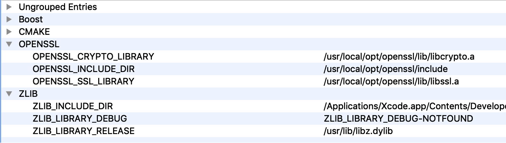

# Build on Mac

## Install Xcode

You should install Xcode by yourself.

## Install CMake

Download the .dmg from [here](https://cmake.org/download/). Just double click and follow the instructions.

## Install Boost

Download the `.tar.bz2` or `.tar.gz` from [here](https://www.boost.org/users/download/#live).

Unpack and go into the directory (suppose Boost version is 1.74):

```
tar -xzf boost_1_74_0.tar.bz2
cd boost_1_74_0
```

Run `bootstrap.sh` to generate `b2`:

```
./bootstrap.sh
```

You can change install prefix with `--prefix` option (default is `/usr/local`, need `sudo`), but I don't recommend.

Build and install:

```
sudo ./b2 --with-date_time variant=debug link=static threading=multi -j4 install
```

Notes:

- Only build the specified libraries. `Asio` itself is header only so doesn’t have to be built.
- Only build static libraries (`link=static`)
- The number after `-j` depends on the number of CPU cores you have.
- If you want to build release version libraries, set `variant=release`. The `debug` and `release` libraries have exactly the same name, so you cannot build them both at the same time.
- Don’t forget the `sudo` since the install prefix is `/usr/local`.

To clean the build, run `b2` with target "clean":

```
./b2 clean
```

The libraries are installed to `/usr/local/lib`. E.g.,

```
$ ls -l /usr/local/lib/libboost*
-rw-r--r--  1 adam  admin   540288 Apr 21 11:01 /usr/local/lib/libboost_date_time.a
...
```

The headers are installed to `/usr/local/include/boost`.

**IMPORTANT**

*CAUTION(2022/04): I'm not sure if this still makes sense.*

Remove the following directory or CMake will not be able to find Boost.

```
sudo rm -r /usr/local/lib/cmake
```

This directory was installed by `b2`. I can’t see why it’s necessary.

## Install OpenSSL

Install with [Homebrew](https://brew.sh/) (the usage of Homebrew itself is out of the scope, please Google and learn it by yourself):

```
brew install openssl
```

Please note that it will be installed to `/usr/local/opt/openssl` instead of `/usr/local`.

## Install Zlib

Zlib should have already been provided by the system (`/usr/lib/libz.dylib`). If not, try to install with Homebrew.

## Build Webcc

Open CMake, set **Where is the source code** to Webcc root directory (e.g., `/Users/adam/github/webcc`), set **Where to build the binaries** to any directory (e.g., `/Users/adam/github/webcc_build`).

Check _**Grouped**_ and _**Advanced**_ two check boxes.

Click _**Configure**_ button. Select "Unix Makefiles" (or "Xcode") as the generator in the popup dialog.

In the center of CMake, you can see a lot of configure options which are grouped and might also be highlighted in RED. Change the options according to your need.

Click _**Configure**_ button again, a message would say that OpenSSL couldn’t be found.

> Could NOT find OpenSSL, try to set the path to OpenSSL root folder in the system variable OPENSSL_ROOT_DIR (missing: OPENSSL_CRYPTO_LIBRARY OPENSSL_INCLUDE_DIR) 

Don’t try to set the `OPENSSL_ROOT_DIR` system variable, it won’t work.

As aforementioned, the OpenSSL was installed by Homebrew, and it’s located in `/usr/local/opt/openssl`. Let’s tell CMake where it is.



Click _**Configure**_ button again. If everything is OK, click _**Generate**_ button.

Open Terminal, go to the build directory, run `make`. E.g.,

```
$ cd github/webcc_build
$ make -j4
```
